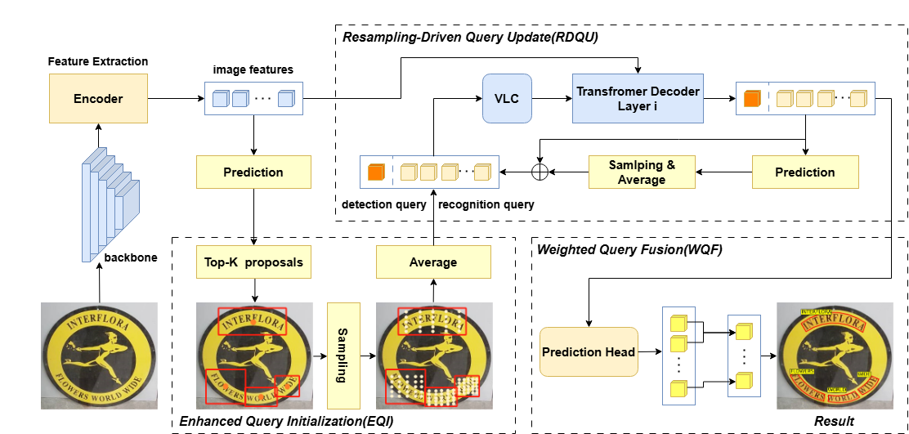
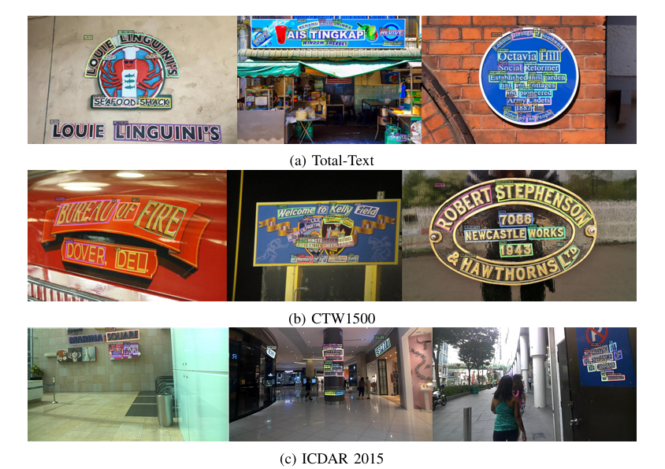

# RDTextSpotter: Enhancing Text Spotting with Resampling-Driven Query Update in Transformer



This is the pytorch implementation of Paper: RDTextSpotter: Enhancing Text Spotting with Resampling-Driven Query Update
in Transformer

## Getting Started

- ### Installation

Python 3.8 + PyTorch 1.10.0 + CUDA 11.3 + torchvision=0.11.0 + Detectron2 (v0.2.1) + OpenCV for visualization

```shell
conda create -n RDTS python=3.8 -y
conda activate RDTS
conda install pytorch==1.10.0 torchvision==0.11.0 torchaudio==0.10.0 cudatoolkit=11.3 -c pytorch -c conda-forge
pip install -r requirements.txt
cd detectron2-0.2.1
python setup.py build develop
pip install opencv-python
cd models/rdts/ops
sh make.sh
```

### Data Preparation

Please download TotalText, CTW1500, MLT, ICDAR2013, ICDAR2015, and CurvedSynText150k according to the guide provided by
SPTS v2:[README.md](https://github.com/bytedance/SPTSv2#dataset).

Extract all the datasets and make sure you organize them as follows

```
- datasets
  | - CTW1500
  |   | - annotations
  |   | - ctwtest_text_image
  |   | - ctwtrain_text_image
  | - totaltext (or icdar2015)
  |   | - test_images
  |   | - train_images
  |   | - test.json
  |   | - train.json
  | - mlt2017 (or syntext1, syntext2)
  |   | - annotations
  |   | - images
```

### Model Zoo

|    Dataset     | Det-P | Det-R | Det-F1 | E2E-None | E2E-Full |                                 Weights                                 |
|:--------------:|:-----:|:-----:|:------:|:--------:|:--------:|:-----------------------------------------------------------------------:|
|  **Pretrain**  |       |       |        |          |          | [Baidu(j2qd)](https://pan.baidu.com/s/1DAwuHSJ7ke50hnot-Z9fUw?pwd=j2qd) |
| **Total-Text** | 89.7  | 90.6  |  90.2  |   80.1   |   86.5   | [Baidu(fe5j)](https://pan.baidu.com/s/1DH3X2tKxVomug1v4ZRNGwQ?pwd=fe5j) |
|  **CTW1500**   | 90.5  | 89.5  |  90.0  |   68.6   |   82.2   | [Baidu(pw9i)](https://pan.baidu.com/s/1-9x8Is4Bo4vdMJT6lE86Qg?pwd=pw9i) |

|    Dataset    | Det-P | Det-R | Det-F1 | E2E-S | E2E-W | E2E-G |                                 Weights                                 |
|:-------------:|:-----:|:-----:|:------:|:-----:|:-----:|:-----:|:-----------------------------------------------------------------------:|
| **ICDAR2015** | 89.4  | 88.7  |  89.0  | 86.0  | 81.7  | 70.0  | [Baidu(ar85)](https://pan.baidu.com/s/1BnCUgUGUT3ft7R9uWG19bA?pwd=ar85) |

### Training

1. Pretrain

```
bash scripts/Pretrain.sh /path/to/your/dataset
```

2. Fine-tune model on the mixed real dataset

```
bash scripts/Joint_train.sh /path/to/your/dataset
```

3. Fine-tune model

```
bash scripts/TT_finetune.sh /path/to/your/dataset
```

### Evaluation

0 for Text Detection; 1 for Text Spotting.

```
bash scripts/eval.sh 
```

### Visualization

Visualize the detection and recognition results

```
python vis.py
```

## Example Results:




